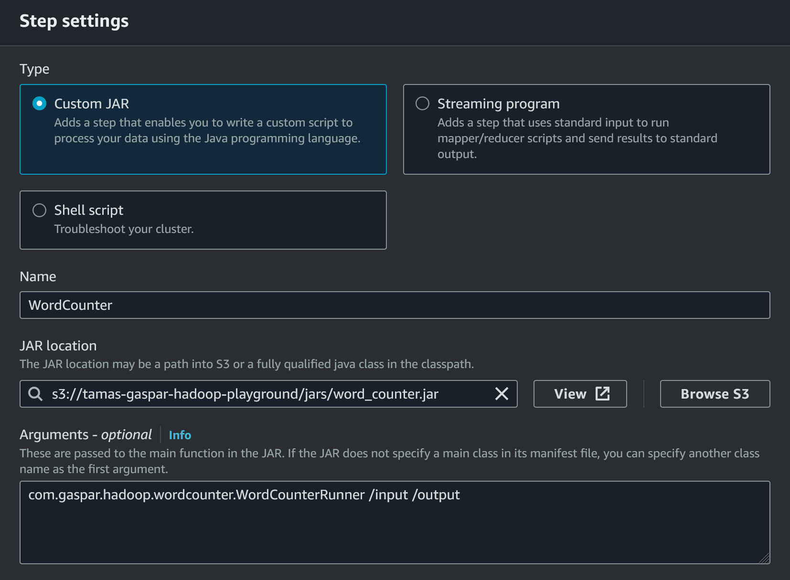

# Hadoop on AWS

This repository contains a simple "word counter" Hadoop MarReduce job, and the 
Terraform code to provision a Hadoop cluster to run it. It uses mainly the AWS 
EMR service, beside some others: S3, IAM, VPC. I did not follow some AWS best practices for the sake of simplicity

# Setup for running the job

### Create JAR

AWS EMR supports Java 8 (yeah...) so make sure to create the JAR with this version of
Java. Replace bucket name in `WordCountRunner.java` because bucket names are globally 
unique and this one is taken by me. Then build JAR.

```
./gradlew :jar
```

Don't change JAR name or location, Terraform expects it to be there.

### Create infrastructure

Make sure to have AWS credentials for Terraform that allow all the required actions (manage 
EMR, S3, IAM, VPC at least). I have an S3 bucket for Terraform state files, but 
you can change it to store the state locally, in that case no need to bother with 
`-backend-config`.

```
cd terraform
terraform init -backend-config="[your terraform state bucket's name]" \
    -backend-config="key=HadoopPlaygroundState.tf" \
    -backend-config="region=eu-central-1" \
    -backend-config="access_key=[your terraform access key for AWS]" \
    -backend-config="secret_key=[your terraform secret key for AWS]"
```

```
terraform plan -out app.tfplan \
    -var aws_key_id="[your terraform access key for AWS]" \
    -var aws_secret_key="[your terraform secret key for AWS]" \
    -var bucket_name="[name of bucket you put in WordCountRunner.java]"
```

Review changes.

```
terraform apply -auto-approve app.tfplan
```

It will take around 5 minutes to provision the cluster. The cluster will consist of 
2 EC2 instances of type `m5.xlarge`. This costs around 0.5$ per hour so shut it 
down when not used. To destroy everything after you are done you can use:

```
terraform destroy -auto-approve \
    -var aws_key_id="[your terraform access key for AWS]" \
    -var aws_secret_key="[your terraform secret key for AWS]" \
    -var bucket_name="[name of bucket you put in WordCountRunner.java]"
```

# Running the Job

It can be done with AWS CLI or the web console. I decided to go with the console.

 - Go to AWS EMR service in the console and select the cluster created by Terraform.
 - They call jobs "steps" so go to Steps tab and `Add Step`.
 - Select `Custom JAR step` and fill the details as shown in the image:



 - Your bucket name will be different of course. Terraform uploaded the JAR file already which you can 
select.

Even more details: https://docs.aws.amazon.com/emr/latest/ReleaseGuide/emr-launch-custom-jar-cli.html

# Job output and logs

In your bucket the job output will be written under the prefix `/output`. The 
logs will be placed under `/logs`.